# jenkins-preview

Publish a throwaway copy of a Jenkins job set, pointed at your own fork and branch, into an isolated folder. Run it, then delete it. The tool never writes outside `/previews`, apart from the optional landing-page tab it creates and deletes itself.

## The whole loop



```bash
uv tool install git+https://github.com/nogueiraanderson/jenkins-preview
export JENKINS_URL=https://ps3.cd.percona.com JENKINS_USER=you JENKINS_TOKEN=...   # or once: credentials.yaml, see Credentials

cd ~/jenkins-pipelines                                     # your fork checkout, on the branch under test
jenkins-preview sets --example > .jenkins-preview.json     # drafts the sets file from your checkout. Run once, edit, commit
jenkins-preview doctor                                     # read-only preflight. A 403 can still appear on the first up
jenkins-preview up --allow-foreign-fetch                   # the set in its own folder, pinned to your branch's pushed tip
jenkins-preview run                                        # next stage in order, cost shown, asks before triggering
jenkins-preview status                                     # build colors, the pin, and whether your branch moved past it
jenkins-preview sync                                       # pushed more commits? Republish at the new tip, same folder
jenkins-preview down                                       # folder and tab removed
```

A `previews` folder must exist on the controller, with permissions inside it ([Setup](#setup-on-the-jenkins-side)).

The set and the folder are inferred from the current checkout. Explicit arguments (`--set <name>`, the folder) always win. When more than one candidate matches, the tool stops and lists them. An inferred `down` asks for confirmation before deleting, and `--yes` skips it.

Some pipelines download code from the main repo while they run, and a preview cannot change that code. `up` lists each such download with its file and line, and `--allow-foreign-fetch` accepts them. The full rules are in [docs/gates.md](docs/gates.md).

## Install

Requires [uv](https://docs.astral.sh/uv/) and `git`. There is no build step and no binary: the tool is Python, and uv installs it as a `jenkins-preview` command in `~/.local/bin` (from a clone, run `uv tool install .` at its root). Development and the demo also use [just](https://just.systems), which uv can provide (`uv tool install rust-just`).

```bash
uv tool install git+https://github.com/nogueiraanderson/jenkins-preview   # as a tool
uvx --from git+https://github.com/nogueiraanderson/jenkins-preview jenkins-preview --help   # without installing
uv run jenkins-preview --help   # from a clone, for development
```

Upgrade with `uv tool upgrade jenkins-preview`, remove with `uv tool uninstall jenkins-preview`.

## Credentials

Credentials come from two sources, resolved per field: the environment first, then a YAML file. The token is never accepted as an argument, because arguments land in `ps`, shell history and CI logs. The tool never prompts for credentials and never writes them.

Create a token at `<your-jenkins>/me/configure` (**Add new Token**, Jenkins shows it once). Then either export:

```bash
export JENKINS_URL=https://jenkins.example.com
export JENKINS_USER=your-jenkins-user-id      # the ID at the top of /me/configure, not the display name
export JENKINS_TOKEN=11aa22bb33cc44dd55ee66ff
```

or keep them in `~/.config/jenkins-preview/credentials.yaml` (`chmod 600`, a group-readable file is refused):

```yaml
current: ps3
servers:
  ps3: {url: "https://ps3.cd.percona.com", user: your-jenkins-user-id, token: "..."}
  pxb: {url: "https://pxb.cd.percona.com", user: your-jenkins-user-id, token: "..."}
```

`JENKINS_SERVER=pxb` picks a server without editing the file, and a single server needs no `current`. Each environment variable individually overrides its file field, so the token can come from the environment while url and user live in the file. `jenkins-preview doctor` names where every field came from and reports what is missing.

## Use

Run the commands from inside your fork checkout, on the branch under test. `--repo` and `--ref` are inferred from it, and passing both previews a different fork. Agents clone the published URL themselves, so an SSH `origin` needs `--repo https://...` or an https remote.

| Command | Does | Flags |
|---|---|---|
| `doctor` | Preflight. No writes. Run this first. | `--set` (default: inferred), `--repo`/`--ref` override the checkout |
| `up` | Render, sanitise, gate, scan build-time fetches, publish with a tab. | `--set` (default: inferred), `--repo`/`--ref`, `--name`, `--dry-run`, `--update` republishes in place, `--allow-foreign-fetch`, `--no-root-view` |
| `status [folder]` | Jobs, results, pinned commit, branch drift, foreign-fetch count. | |
| `run [folder]` | Trigger the next stage, producers first. `-p` reaches the stage's jobs, other published jobs start from the preview's own UI. | `--stage`, `-p KEY=VALUE` repeatable (needs `--stage`), `--yes` |
| `sync [folder]` | Republish at the branch's new tip. Same folder, same tab choice, same acknowledgment while the blocking fetches stay unchanged. | `--allow-foreign-fetch` for newly introduced fetches |
| `down [folder]` | Delete the folder and its tab. | `--yes` skips the inferred-folder confirmation, `--force` for running builds |
| `list` / `reap` | Inventory, and age-based cleanup. Bare `reap` deletes eligible marked previews older than 7 days, any owner, no prompt, and skips what it cannot safely verify. | `reap` only: `--older-than <days>` (default 7), `--dry-run`, `--force` for running builds |
| `sets` | Loaded job sets and the file they came from. | `--example` drafts a file from the checkout, `--discover <yaml_dir>` picks the directory explicitly |

Worked sessions: [docs/examples.md](docs/examples.md).

## Setup on the Jenkins side

One folder named `previews` must exist at the Jenkins root. Inside it your account needs Job Read, Create, Configure, Build and Delete, plus root `View/Create` and `View/Delete` for the default tab (skip it with `--no-root-view`). `doctor` names a missing folder, but never probes permissions, so a 403 can still appear on the first `up`.

## Job sets

Draft the file with `sets --example`. It renders the checkout's YAML directory and prints a valid file. Every rendered job is listed, and the pipeline jobs form one starting `main` stage. Files that fail to render are skipped, each with JJB's own error. The directory is inferred from the working directory or from the files the branch edits. When several directories qualify, the tool stops and prints each one as a ready-to-run `sets --discover <yaml_dir>` command. Edit the stages and commit the file at the checkout root.

Lookup order: `--sets PATH`, `$JENKINS_PREVIEW_SETS`, `.jenkins-preview.json` at the checkout root, `~/.config/jenkins-preview/sets.json` (`$XDG_CONFIG_HOME` honoured). Every entry is validated on load, and a broken one is refused outright. `status`, `down`, `list` and `reap` read only the ownership markers, so even a broken sets file never blocks a teardown.

Editing the file changes the next `up`, `run` or `sync`, never what is already published. Republish an edited set with `up --set <set> --update`. Schema and the edit-after-publish table: [docs/examples.md](docs/examples.md).

## Scope

Previews live inside the `/previews` folder, and gate G1 confines every write to it. The folder boundary does not constrain build time: a pipeline loaded from a fork chooses its own agent label and credentials, so publish previews only of code you trust. Do not pass secrets as build parameters: arguments are visible in `ps` and in shell history, and the Password and Credentials parameter types are refused. The rules are in [docs/gates.md](docs/gates.md).

## Development

Recipes live in the [justfile](justfile). Bare `just` lists them.

```bash
just test       # the suite, no network or Jenkins needed
just test-one fidelity   # tests matching a keyword
just fmt        # format
just lint
just ci         # the CI gates locally, wheel smoke test included (CI adds a 3.14 leg)
```

Wire the same gates into `git commit` with `uvx pre-commit@4.6.0 install`
([.pre-commit-config.yaml](.pre-commit-config.yaml), pinned to CI's versions).

## Docs

- [demo/index.html](demo/index.html): animated tour of the whole loop (`just demo` opens it)
- [docs/examples.md](docs/examples.md): worked, copy-pasteable sessions
- [docs/design.md](docs/design.md): decisions, and the Jenkins mechanics behind them
- [docs/gates.md](docs/gates.md): what the tool refuses to do, and why
- [docs/jjb.md](docs/jjb.md): why this exists, and how it differs from plain Jenkins Job Builder
- [docs/SPEC.md](docs/SPEC.md): every behaviour and its test, enforced by the suite
- [docs/troubleshooting.md](docs/troubleshooting.md): errors and their fixes

## Licence

MIT
